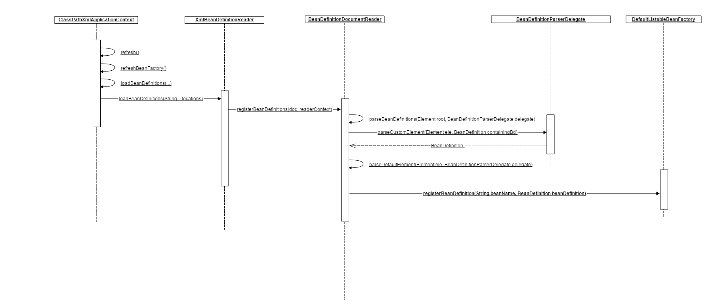

#### 一般我们可以通过以下方式读取Spring的配置：
```
ApplicationContext ac = new ClassPathXmlApplicationContext("test/applicationContext.xml");
```

#### 读取配置之后，Spring会根据配置文件进行一系列的初始化工作。

以下是扫描包的入口：
```
ConfigurableListableBeanFactory beanFactory = obtainFreshBeanFactory();
```

#### 通过解析xml文件，定义BeanDefinition
将xml的bean元素中定义的相关信息，封装到一个BeanDefinition对象中，并且将该对象存到一个map中，map的key为beanName。
```
this.beanDefinitionMap.put(beanName, beanDefinition);
this.beanDefinitionNames.add(beanName);
this.manualSingletonNames.remove(beanName);
```
