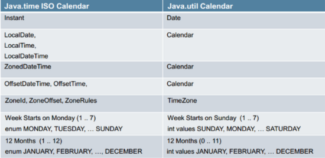

- UTC是我们现在用的时间标准
- UTC是根据原子钟来计算时间

- GMT是老的时间计量标准。
- GMT是根据地球的自转和公转来计算时间，也就是太阳每天经过位于英国伦敦郊区的皇家格林威治天文台的时间就是中午12点。由于现在世界上最精确的原子钟50亿年才会误差1秒(最精确原子钟问世：50亿年误差一秒)，可以说非常精确。而GMT因为是根据地球的转动来计算时间的，而地球的自转正在缓速变慢，所以使用GMT的话，总有一天，打个比方，中午12点，并不是一天太阳当头照的时候，很可能就是早上或者晚上了。所以说UTC更加精确。

---

JDK8之前日期API的问题：

- Java的日期/时间类的定义并不一致，在java.util和java.sql的包中都有日期类，此外用于格式化和解析的类在java.text包中定义。
- java.util.Date同时包含日期和时间，而java.sql.Date仅包含日期，将其纳入java.sql包并不合理。另外这两个类都有相同的名字，这本身就是一个非常糟糕的设计。
- 对于时间、时间戳、格式化以及解析，并没有一些明确定义的类。对于格式化和解析的需求，我们有java.text.DateFormat抽象类，但通常情况下，SimpleDateFormat类被用于此类需求。
- 所有的日期类都是可变的，因此他们都不是线程安全的，这是Java日期类最大的问题之一。
- 日期类并不提供国际化，没有时区支持，因此Java引入了java.util.Calendar和java.util.TimeZone类，但他们同样存在上述所有的问题。

JDK8引入新的日期API的设计原则：
- 不变性：新的日期/时间API中，所有的类都是不可变的，这对多线程环境有好处。
- 关注点分离：新的API将人可读的日期时间和机器时间（unix timestamp）明确分离，它为日期（Date）、时间（Time）、日期时间（DateTime）、时间戳（unix timestamp）以及时区定义了不同的类。
- 清晰：在所有的类中，方法都被明确定义用以完成相同的行为。举个例子，要拿到当前实例我们可以使用now()方法，在所有的类中都定义了format()和parse()方法，而不是像以前那样专门有一个独立的类。为了更好的处理问题，所有的类都使用了工厂模式和策略模式，一旦你使用了其中某个类的方法，与其他类协同工作并不困难。
- 实用操作：所有新的日期/时间API类都实现了一系列方法用以完成通用的任务，如：加、减、格式化、解析、从日期/时间中提取单独部分，等等。
- 可扩展性：新的日期/时间API是工作在ISO-8601日历系统上的，但我们也可以将其应用在非IOS的日历上。

---

- Clock - 可以用它来获取某个时区下当前的瞬时时间，日期或者时间
- Instant - 它代表的是时间戳
- LocalDate - 不包含具体时间的日期，比如2014-01-14。它可以用来存储生日，周年纪念日，入职日期等。
- LocalTime - 它代表的是不含日期的时间
- LocalDateTime - 它包含了日期及时间，不过还是没有偏移信息或者说时区。
- ZonedDateTime - 这是一个包含时区的完整的日期时间，偏移量是以UTC/格林威治时间为基准的。
